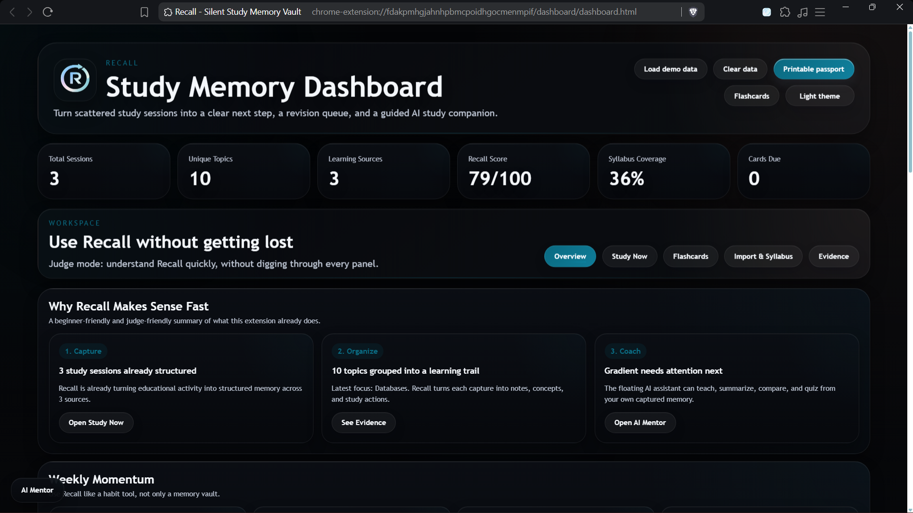
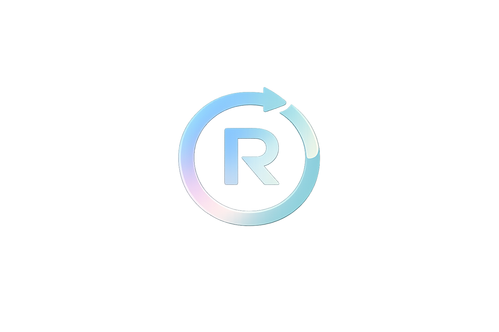
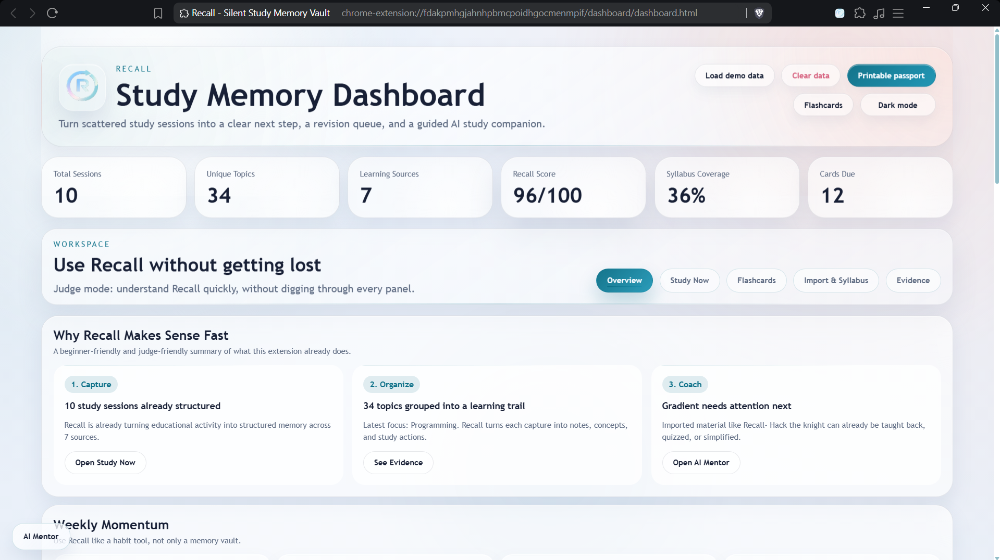
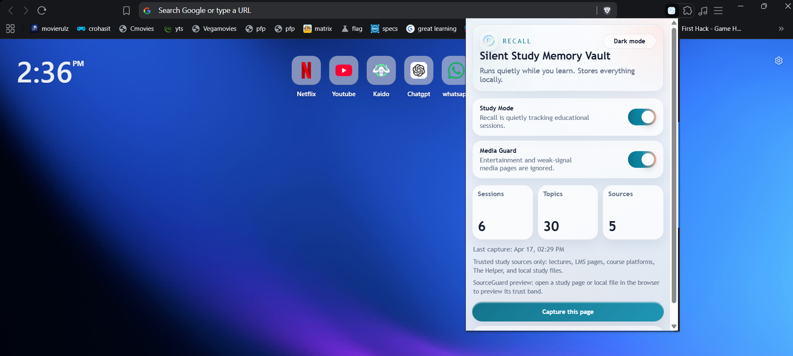
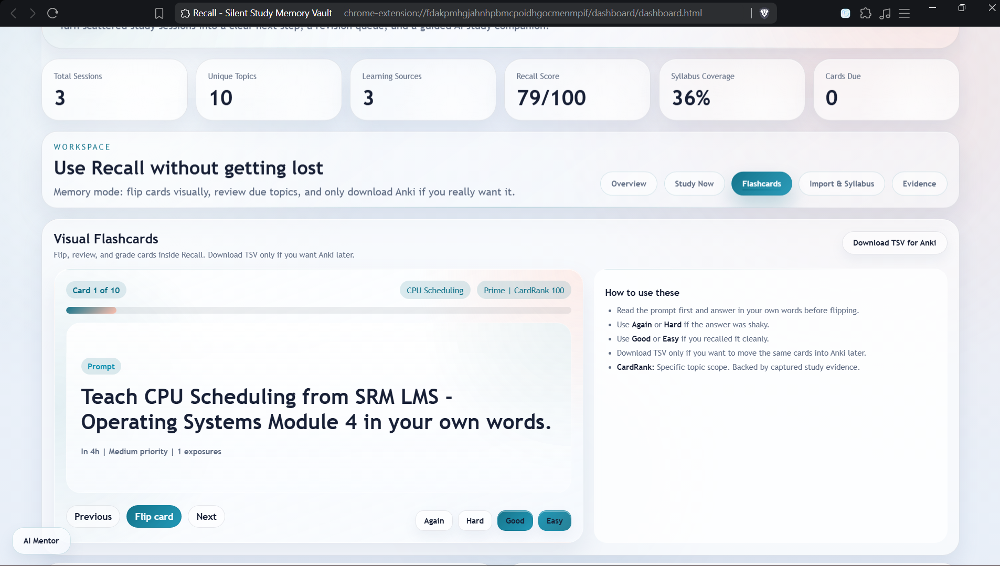
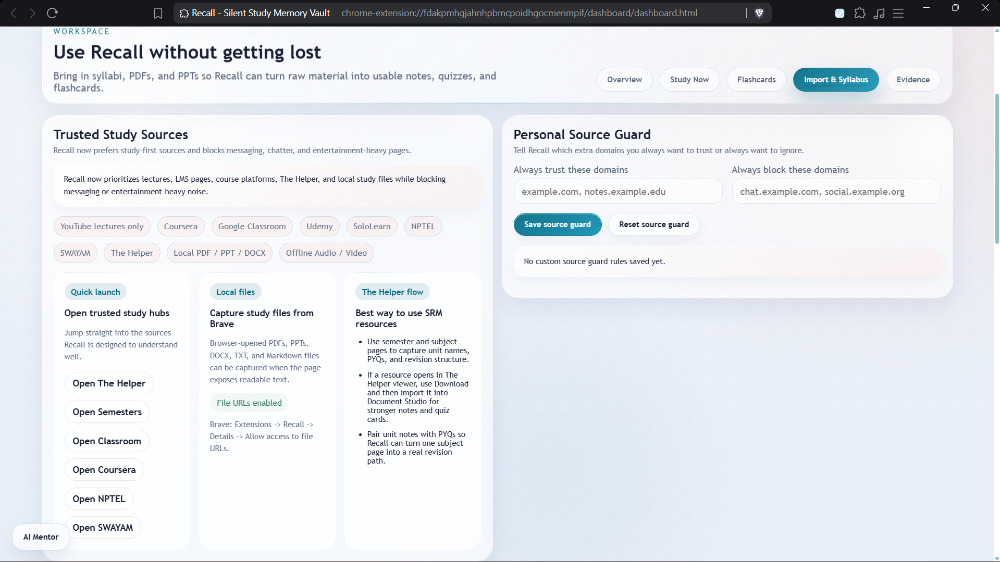
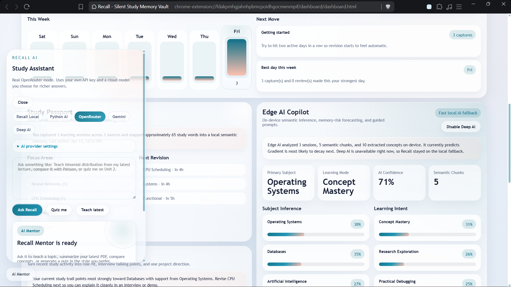

# Recall

  

  <strong>Turn scattered study activity into structured memory, revision prompts, flashcards, and explainable study guidance.</strong>

  
  
  
  

  
  
  
  

<table>
  <tr>
    <td width="62%">
      
    </td>
    <td width="38%">
      
    </td>
  </tr>
</table>

## What Recall Is

Recall is a local-first AI study memory extension built for students who learn across:

- YouTube lectures
- LMS portals and classroom pages
- course platforms like Coursera, Udemy, NPTEL, SWAYAM, and SoloLearn
- The Helper and similar academic resource hubs
- browser-opened PDFs, PPTs, DOCX files, TXT notes, and Markdown
- imported audio, video, and document study material

Instead of acting like a normal browser history tool, Recall tries to answer:

1. What did I actually study?
2. What should I revise next?
3. Can I trust this source as real study material?
4. How does this connect to exams, projects, or placements?

## Why It Matters

Students do not fail because content is unavailable. They struggle because learning is scattered, revision order is unclear, and raw notes are too messy to reuse. Recall turns those fragmented sessions into a memory layer that is usable.

## What Ships Today

| Area | What Recall gives the user |
| --- | --- |
| `Capture` | Passive educational capture through `Study Mode` |
| `Filtering` | Distraction and weak-signal rejection through `Media Guard` |
| `Understanding` | Topic extraction, summaries, subject inference, and source-aware memory |
| `Study Output` | Notes, flashcards, quiz prompts, guided sessions, and revision queues |
| `Import` | PDF, PPTX, DOCX, TXT, Markdown, audio, and video support |
| `Explainability` | Audit logs, source confidence, and evidence mode |
| `AI Support` | Local AI, optional deep AI, offline speech AI, and optional Python/cloud assistants |

## Product Gallery

<table>
  <tr>
    <td width="50%">
      
      
<strong>Popup and quick controls</strong> Visible control through <code>Study Mode</code> and <code>Media Guard</code> keeps Recall lightweight during normal browsing.

    </td>
    <td width="50%">
      
      
<strong>Overview dashboard</strong> Sessions, topics, sources, recall score, and next-step study direction in one workspace.

    </td>
  </tr>
  <tr>
    <td width="50%">
      
      
<strong>Flashcards and active recall</strong> Captured material becomes revision-ready flashcards instead of static storage.

    </td>
    <td width="50%">
      
      
<strong>Import and trusted-source controls</strong> Documents, offline material, and trusted-source guidance work together instead of being bolted on later.

    </td>
  </tr>
  <tr>
    <td colspan="2">
      
      
<strong>AI Mentor and edge intelligence</strong> Mentor prompts, subject inference, and edge AI help turn captured study sessions into guided learning support.

    </td>
  </tr>
</table>

## Core Workspaces

### Overview

Best for:

- first-time users
- judge demos
- fast understanding of the product

Shows:

- captured sessions
- trusted sources
- weekly momentum
- revision direction
- placement-facing insights

### Study Now

Best for:

- practical revision
- readable notes instead of raw extracted text
- deciding what to do next

### Flashcards

Best for:

- active recall
- spaced repetition
- grading memory with `Again / Hard / Good / Easy`

### Import and Syllabus

Best for:

- imported files and offline material
- comparing captures against an SRM syllabus
- trusted source shortcuts

### Evidence

Best for:

- explainability
- proving Recall is not blindly capturing everything
- demo credibility

## AI Stack

Recall uses multiple AI layers instead of one generic chatbot.

| Layer | Role |
| --- | --- |
| `Recall Local` | Core study reasoning, notes, quiz prompts, flashcards, and guidance |
| `SourceGuard` | Source trust scoring for educational vs weak-signal material |
| `CardRank` | Flashcard quality scoring and reranking |
| `Deep AI` | Optional stronger semantic inference through `Transformers.js` |
| `Offline Speech AI` | Optional Whisper-based transcription for imported audio and video |
| `Python AI` | Broader assistant behavior through `python_ai/` |
| `Optional Cloud AI` | Gemini and OpenRouter support when configured by the user |

## Privacy and Performance Snapshot

Recall is designed to be local-first and practical on normal laptops.

| Mode | CPU | Memory | Storage |
| --- | --- | --- | --- |
| Default extension usage | Low, with short spikes during capture | Low to moderate | Low to moderate |
| Optional deep AI / transcription | Moderate to temporarily high during local model work | Moderate to temporarily high | Moderate because model caches and transcripts grow locally |

Key points:

- structured data is stored locally with browser storage and `IndexedDB`
- heavy AI paths are optional instead of always-on
- Recall focuses on meaningful session memory, not raw surveillance-style logging

## Documentation Package

This repo includes a fuller documentation set for project sharing, expansion planning, and external review:

- [Full documentation - Markdown](docs/RECALL_DOCUMENTATION_AND_EXPANSION_IDEA.md)
- [Full documentation - Word](docs/RECALL_DOCUMENTATION_AND_EXPANSION_IDEA.docx)
- [Short summary - Markdown](docs/RECALL_SUMMARY_OVERVIEW.md)
- [Short summary - Word](docs/RECALL_SUMMARY_OVERVIEW.docx)
- screenshot assets in [`docs/images/`](docs/images/)

The docs package covers:

- current product scope
- expansion into a future work-memory system
- app vs sandbox comparison
- performance impact discussion
- adjacent products and why Recall is different

## Team

Team `LOQIN`

- Dito Dileep - RA2411026010050
- Adithya R Nath - RA2411026010003
- Shreya Medimi - RA2411026010037
- Muhammed Adnan Abdullah - RA2411026011207

## Tech Map

- Extension manifest: [manifest.json](manifest.json)
- Background logic: [background.js](background.js)
- Popup UI: [popup/popup.html](popup/popup.html)
- Dashboard UI: [dashboard/dashboard.html](dashboard/dashboard.html)
- Local data layer: [lib/db.js](lib/db.js)
- Shared memory logic: [lib/shared.js](lib/shared.js)
- Python assistant path: [python_ai/](python_ai/)

## Closing

Recall is not trying to be just another note tool, browser logger, or chatbot wrapper.

Its core idea is simple:

**turn real study activity into usable memory and next-step learning output.**

That is what makes the current extension valuable, and it is also what makes the longer-term expansion idea compelling.
